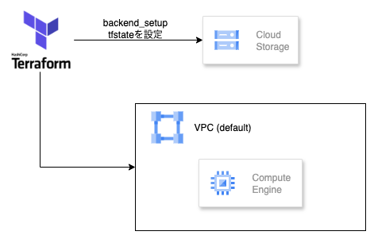

# GC-backend-sample

Terraform を利用して Google Cloud 上にバックエンド基盤を構築するためのサンプルリポジトリです。ブログ記事「Terraform の状態ファイルを Cloud Storage に置く（[参考](https://zenn.dev/oyasumipants/articles/8f0ac1a3395520)）」で紹介されている手順のうち、`terraform.tfstate を CloudStrage に保存する` 以降をベースに、環境ごとのリモートステート構成を再現しています。

## 作成物の構成図(イメージ)



## ディレクトリ構成

```
.
├── backend_setup/        # tfstate を保管する Cloud Storage バケットを作成するための構成
├── environments/
│   ├── dev/              # 開発環境向け Terraform 設定（GCS backend を利用）
│   ├── stg/              # 準備済みディレクトリ（必要に応じて dev を複製）
│   └── prd/              # 本番環境用ディレクトリ（必要に応じて dev を複製）
├── modules/
│   └── setup/            # 共通モジュール（Compute Engine インスタンスなど）
└── docs/                 # 図面等の補足資料
```

## 前提条件

- Terraform 1.5 以降
- GCP プロジェクトと課金の有効化
- `gcloud` CLI を使った認証（`gcloud auth application-default login` など）
- Terraform から利用できる認証情報（アプリケーションデフォルト認証、もしくはサービスアカウント鍵）

## 利用手順

### 1. tfstate 用 Cloud Storage バケットの作成

1. `backend_setup/variables.tf` の `project_id` と `region` をご自身の環境に合わせて変更します。
2. `backend_setup/main.tf` の `google_storage_bucket.terraform_state` にある `name`（バケット名）と `location` を調整してください。
3. まだバケットが存在しないため、このディレクトリではリモートステートを有効化しません。`backend_setup/backend.tf` はコメントアウトされたままで OK です。
4. バケット作成：

   ```bash
   cd backend_setup
   terraform init
   terraform plan
   terraform apply
   ```

   実行が完了すると、tfstate を保存する Cloud Storage バケットが作成されます。
5. その後、`backend_setup/backend.tf` はコメントアウトを外します。そして、`terraform init`を実行すると、Cloud Storageに`tfstate`ファイルができます。ローカルのものは削除しておきましょう。

### 2. 環境ごとの Terraform を初期化

1. `environments/dev/backend.tf` を開き、`bucket` と `prefix` を実際に作成したバケット・ディレクトリに合わせて変更します。
2. 必要に応じて `environments/dev/variables.tf` 内の `project_id` や `region` を更新します。
3. 初期化とデプロイ：

   ```bash
   cd environments/dev
   terraform init
   terraform plan
   terraform apply
   ```

   初期化時に `gcs` バックエンドが有効になり、`terraform.tfstate` は Cloud Storage に保存されます。

4. 別環境（`stg`, `prd`）を作成する場合は `environments/dev` をコピーし、`environment` 変数と `backend.tf` の `prefix` を環境名に合わせて変更してください。

### 3. モジュール構成

- `modules/setup` には共通リソース（例：Compute Engine インスタンス）が定義されています。
- `environments/*/main.tf` からこのモジュールを呼び出し、環境固有の変数を渡す構成になっています。

## 運用メモ

- 状態ファイルをリモート化した後にバケット自体を Terraform で管理する場合は、`backend_setup/backend.tf` のコメントを外してバックエンドを再初期化することで循環参照を避けつつ管理できます。（再初期化時は `terraform init -migrate-state` を利用してください。）
- バケット名はグローバルに一意である必要があるため、重複しない命名パターン（`<project>-terraform-state` など）を推奨します。
- 認証情報をバージョン管理に含めないよう注意してください。

## クリーンアップ

インフラを破棄する場合は、環境ディレクトリで `terraform destroy` を実行します。最後に Cloud Storage バケットを削除する際は、バケット内の `terraform.tfstate` を手動で削除するか、事前に `backend_setup` をローカルステートへ戻してから実行してください。

